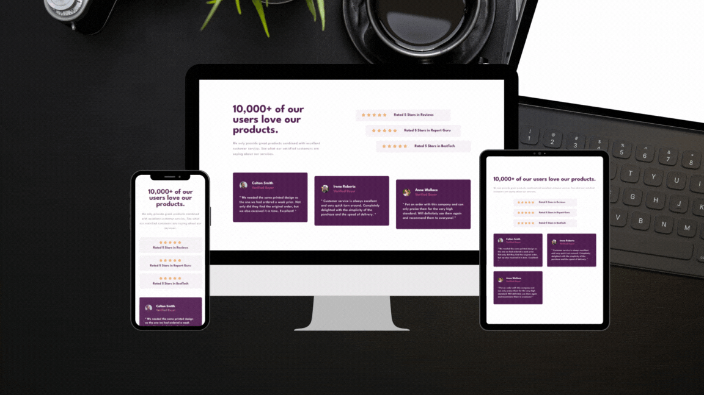

# Frontend Mentor - Solução de seção de prova social

Esta é uma solução para o [Desafio da seção de prova social no Frontend Mentor](https://www.frontendmentor.io/challenges/social-proof-section-6e0qTv_bA). Os desafios do Frontend Mentor ajudam você a melhorar suas habilidades de codificação construindo projetos realistas.

## Índice

- [Visão geral](#visão-geral)
- [O desafio](#o-desafio)
- [Captura de tela](#captura-de-tela)
- [Links](#links)
- [Meu processo](#meu-processo)
- [O que aprendi](#o-que-aprendi)
- [Autor](#autor)

## Visão geral

### O desafio

Os usuários devem ser capazes de:

- Visualizar o layout ideal para a seção, dependendo do tamanho da tela do dispositivo

### Captura de tela



### Links

- URL da solução: [https://github.com/JottaCa/social-proof-section](https://github.com/JottaCa/social-proof-section)
- URL do site ativo: [https://jottaca.github.io/social-proof-section/](https://jottaca.github.io/social-proof-section/)

## Meu processo

### Criado com

- Marcação HTML5 semântica
- Propriedades personalizadas CSS
- Flexbox
- Grid CSS
- Fluxo de trabalho desktop-first

### O que aprendi

Ao concluir este projeto do Frontend Mentor, aperfeiçoei diversas habilidades essenciais para o desenvolvimento frontend. Utilizei Flexbox e Grid para criar layouts responsivos e bem estruturados, além de aprimorar minha experiência com design responsivo, garantindo que as páginas se adaptem perfeitamente a diferentes dispositivos:

```css
.container .customer-reviews {
    grid-area: customer-reviews;
    display: grid;
    gap: 32px;
    grid-template-columns: repeat(auto-fit, minmax(222px, 1fr));
    place-items: center;
}
```

Ainda, desenvolvi boas práticas de controle de versão utilizando Git, e organizei meu código de forma a facilitar a manutenibilidade.

## Autor

- Site - [Jonathan Barbosa](https://jottaca.github.io/portfolio/m)
- Mentor de front-end - [@devemdobro](https://github.com/devemdobro/devemdobro)